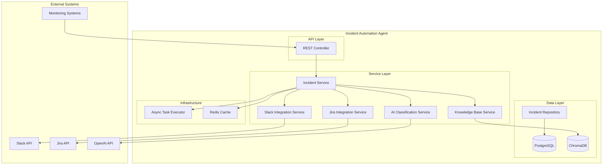

# Design Document

## Overview

The XLBiz.AI Incident Automation Agent is designed as a microservice-based system that processes incident alerts through intelligent AI classification and automated multi-platform integrations. The system follows a layered architecture with clear separation of concerns, enabling scalability, maintainability, and reliable incident processing workflows.

## Architecture

### System Architecture Diagram



### Component Interaction Flow

1. **Incident Reception**: External monitoring systems POST incident data to REST API
2. **Validation & Persistence**: System validates payload and stores initial incident record
3. **AI Processing**: AI service classifies severity and generates remediation suggestions
4. **Knowledge Base Query**: Vector search retrieves relevant solutions from knowledge base
5. **Integration Orchestration**: Async processing triggers Slack and Jira integrations
6. **Status Updates**: System updates incident record with integration results

## Components and Interfaces

### REST API Layer

**IncidentController**
- Handles HTTP requests for incident processing
- Implements request validation and response formatting
- Provides endpoints for incident management and status queries
- Integrates with Spring Boot's error handling mechanisms

**Key Endpoints:**
```java
@PostMapping("/api/incidents/trigger")
ResponseEntity<IncidentResponse> triggerIncident(@RequestBody IncidentRequest request)

@GetMapping("/api/incidents/{id}/status")
ResponseEntity<IncidentStatusResponse> getIncidentStatus(@PathVariable String id)

@GetMapping("/api/incidents")
ResponseEntity<Page<IncidentSummary>> listIncidents(@RequestParam Map<String, String> filters)

@GetMapping("/api/incidents/stats")
ResponseEntity<IncidentStats> getIncidentStatistics()
```

### Service Layer

**IncidentService (Core Orchestrator)**
- Coordinates the entire incident processing workflow
- Manages transaction boundaries and error handling
- Implements async processing for non-blocking operations
- Handles incident lifecycle management

**AiClassificationService**
- Integrates with OpenAI API for severity classification
- Implements prompt engineering for consistent results
- Handles AI response parsing and validation
- Provides fallback classification logic

**SlackIntegrationService**
- Manages Slack channel creation and messaging
- Implements stakeholder invitation logic
- Handles Slack API rate limiting and retries
- Formats incident summaries for Slack presentation

**JiraIntegrationService**
- Creates and manages Jira tickets
- Maps incident data to Jira field structures
- Handles project and component assignment
- Implements ticket update workflows

**KnowledgeBaseService**
- Manages vector database operations
- Implements similarity search for incident patterns
- Handles knowledge base updates and maintenance
- Provides confidence scoring for solutions

### Data Layer

**Incident Entity Model**
```java
@Entity
@Table(name = "incidents")
public class Incident {
    @Id
    @GeneratedValue(strategy = GenerationType.IDENTITY)
    private Long id;
    
    @Column(unique = true, nullable = false)
    private String externalId;
    
    @Enumerated(EnumType.STRING)
    private IncidentType type;
    
    @Enumerated(EnumType.STRING)
    private IncidentSeverity severity;
    
    @Enumerated(EnumType.STRING)
    private IncidentStatus status;
    
    @Type(type = "jsonb")
    private Map<String, Object> metadata;
    
    // Integration tracking fields
    private String slackChannelId;
    private String slackMessageTs;
    private String jiraTicketKey;
    
    // AI analysis results
    @Column(columnDefinition = "TEXT")
    private String aiSuggestion;
    
    @Column(columnDefinition = "TEXT")
    private String aiReasoning;
    
    // Audit fields
    private LocalDateTime createdAt;
    private LocalDateTime updatedAt;
}
```

**Repository Layer**
- Extends Spring Data JPA for database operations
- Implements custom queries for incident filtering
- Provides audit trail and statistics queries
- Handles database transaction management

## Data Models

### Core Domain Models

**IncidentRequest (Input DTO)**
```java
public class IncidentRequest {
    @NotBlank
    private String id;
    
    @NotNull
    private IncidentType type;
    
    @NotBlank
    private String description;
    
    private IncidentSeverity severity; // Optional, AI will classify
    
    @NotBlank
    private String source;
    
    @NotNull
    private LocalDateTime timestamp;
    
    private Map<String, Object> metadata;
}
```

**IncidentResponse (Output DTO)**
```java
public class IncidentResponse {
    private String incidentId;
    private IncidentStatus status;
    private IncidentSeverity aiClassifiedSeverity;
    private String aiSuggestion;
    private IntegrationStatus integrationStatus;
    private LocalDateTime processedAt;
}
```

**Knowledge Base Entry**
```java
public class KnowledgeEntry {
    private String id;
    private IncidentType incidentType;
    private List<String> symptoms;
    private List<String> solutions;
    private double[] embedding;
    private double confidenceScore;
    private Map<String, String> metadata;
}
```

### Vector Database Schema

**ChromaDB Collections:**
- `incident_patterns`: Stores incident type patterns with embeddings
- `solutions`: Contains remediation solutions with vector representations
- `historical_resolutions`: Tracks successful resolution patterns

## Error Handling

### Error Handling Strategy

**Graceful Degradation Approach:**
1. **AI Service Failure**: Use rule-based classification fallback
2. **Slack Integration Failure**: Log error, continue with Jira integration
3. **Jira Integration Failure**: Store ticket request for retry processing
4. **Database Failure**: Return error but maintain system availability
5. **Knowledge Base Failure**: Provide generic suggestions based on incident type

**Error Response Format:**
```java
public class ErrorResponse {
    private String errorCode;
    private String message;
    private LocalDateTime timestamp;
    private Map<String, String> details;
    private String traceId;
}
```

**Retry Mechanisms:**
- Exponential backoff for external API calls
- Circuit breaker pattern for service protection
- Dead letter queue for failed integration requests
- Health check endpoints for monitoring

## Testing Strategy

### Testing Pyramid

**Unit Tests (70%)**
- Service layer business logic testing
- AI response parsing validation
- Data model validation
- Repository layer testing

**Integration Tests (20%)**
- API endpoint testing with TestContainers
- Database integration testing
- External service mocking
- End-to-end workflow testing

**Contract Tests (10%)**
- Slack API contract validation
- Jira API contract validation
- OpenAI API response validation
- Database schema validation

### Test Data Management

**Test Fixtures:**
- Sample incident payloads for different scenarios
- Mock AI responses for classification testing
- Slack/Jira API response mocks
- Knowledge base test data

**Testing Infrastructure:**
- TestContainers for PostgreSQL and ChromaDB
- WireMock for external API simulation
- Spring Boot Test slices for focused testing
- Test profiles for different environments

## Security Considerations

### API Security
- Input validation and sanitization
- Rate limiting for incident endpoints
- Authentication for administrative endpoints
- CORS configuration for web clients

### Integration Security
- Secure credential management via environment variables
- API token rotation support
- TLS encryption for all external communications
- Audit logging for security events

### Data Protection
- Sensitive data masking in logs
- Database encryption at rest
- Secure handling of incident metadata
- GDPR compliance for user data

## Performance Considerations

### Scalability Design
- Async processing for non-blocking operations
- Connection pooling for database and external APIs
- Caching for frequently accessed data
- Horizontal scaling support

### Performance Targets
- Incident processing: < 2 seconds for API response
- AI classification: < 5 seconds average
- Slack integration: < 3 seconds for channel creation
- Jira integration: < 4 seconds for ticket creation
- Database queries: < 100ms for standard operations

### Monitoring and Observability
- Application metrics with Micrometer
- Distributed tracing with Spring Cloud Sleuth
- Health check endpoints for load balancers
- Custom metrics for business KPIs

## Deployment Architecture

### Infrastructure Components
- Spring Boot application (JAR deployment)
- PostgreSQL database with connection pooling
- ChromaDB vector database
- Redis for caching and session management
- Load balancer for high availability

### Configuration Management
- Environment-specific application.yml files
- External configuration via Spring Cloud Config
- Secret management via environment variables
- Feature flags for gradual rollouts

### Monitoring and Alerting
- Application logs with structured logging
- Metrics collection via Prometheus
- Alerting rules for system health
- Dashboard visualization with Grafana